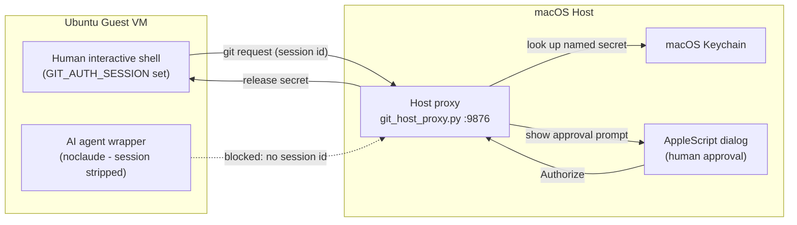

# **Secure Local AI Architecture on macOS with Linux guests**

## **1. Overview and Rationale**

I want to run AI systems while countering security risks. Here's my basic approach. As the industry learns more, I'm sure there will be better ways long-term, but I want to have a reasonable approach given the limited information currently available. I've documented my approach in case others want to use it as a starting point.

Security goals: I want to ensure the AI (both harnesses & any local inference engine) can't gain access to my personal credentials, arbitrarily read personal files, or push to repos like GitHub. Generally the AI should be able to get/read external data and approved repo data, manipulate local files, run local Linux commands within a VM, and present proposals that I can then choose to review and/or push.

I'll run Ubuntu Linux Virtual Machines (VMs) that run AI harnesses contained by nono. The harnesses then call out to both local & remote AI inference engines. The Linux VMs will be hosted on MacOS (Macs have a unified memory which is helpful for running local models). Note:

> * **Execution Layer (Ubuntu VMs via UTM):** All AI tools, scripts, and network activities run inside isolated Ubuntu Linux virtual machines. Separate VMs isolate blast radiuses.
> * **Inference Layer (macOS host \_infer user):** Local inference engines (such as llama.cpp or Stable Diffusion runtimes) run natively on macOS to access Metal GPU acceleration. The local inference process runs under a separate unprivileged macOS account named \_infer and the normal user's home directory is intentionally NOT accessible by \_infer. This prevents the inference engine from accessing primary user files or keys.
> * **Credential Isolation:** VMs store no passwords, private SSH keys, or long-lived tokens. A host-side proxy (`git_host_proxy.py`) holds secrets in macOS Keychain and releases one only after a human clicks "Authorize" on a GUI prompt naming which secret and what git operation triggered it. See "Git Authentication Bridge" below. (An earlier draft of this required a YubiKey-backed SSH key for pushes; that turned out to be overkill given the human-approval step already in place, so it's dropped.)
> * **Local Attack Containment and Egress Control:** The VM kernel restricts privilege escalation via PR\_SET\_NO\_NEW\_PRIVS. Outbound network traffic is limited by nftables to DNS, SSH, and HTTP/HTTPS, permitting local security testing against loopback without exposing external networks to arbitrary attack traffic. The AIs are further limited inside the VM by nono and can only get access to "current directory and down" (never its home directory). The printer (CUPS) access by network is disabled; only Unix socket is permitted, which nono easily prevents.

## **2. Security Controls Summary**

| Component | Implementation | Security Function   |
| :---- | :---- | :---- |
| Host Filesystem | chmod go-rwx /Users/$USER | Blocks the AI inference code (running in the \_infer user account) from reading primary host user data. |
| Shared Storage | /Users/Shared | Permits controlled file exchange outside home directories. |
| Code Egress | Host Keychain secret + human-approved GUI prompt | VM never holds a token; every git fetch/push needs a per-request click on the host (`git_host_proxy.py`). |
| VM Sandboxing | nono run \--allow . | Enforces kernel-level Landlock limits to $PWD and disables sudo via PR\_SET\_NO\_NEW\_PRIVS. |
| Network Egress | nftables ruleset | Restricts outbound traffic to ports 22, 53, 80, and 443 while permitting local loopback attacks. |
| Print Isolation | CUPS bound to /run/cups/cups.sock | Permits human printing via D-Bus/libcups while nono blocks AI access to the socket file. |
| Network Exposure | SSH Reverse Tunnel (RemoteForward) | Keeps inference ports bound to 127.0.0.1, avoiding LAN exposure. (Not yet built out - see `ENABLE_INFERENCE_SSH_TUNNEL` in config.sh.) |
| VM Access | Host `~/.ssh/id_ed25519` (plain, no hardware key), pushed to each VM's `authorized_keys` via `ssh-copy-id`; `~/.ssh/config` built from live `utmctl` queries | One-directional human convenience login (`ssh`/`scp` a VM by name); VMs never get host access. Adding a VM needs no host-side config, no commit - `host-setup.sh` re-queries UTM and re-pushes the key every run. |

**Known limitation, accepted rather than solved:** ports 80 and 443 are allowed to *any* destination (general web/package/doc access is a hard requirement, not optional), so a compromised or malicious agent inside a VM can still exfiltrate data or receive C2 instructions over HTTPS to any host it wants - port-based filtering can't tell that apart from legitimate traffic, since both are just TLS on 443. A stronger mitigation would filter by destination instead of port (TLS's SNI field is sent in cleartext, so domain-allowlisting is possible without decrypting traffic), but that's real added complexity - a filtering proxy, plus a domain allowlist to maintain - not implemented here. What the current egress rules *do* buy you: blocking non-web C2/exfiltration channels and lateral movement to arbitrary ports. The things that matter most (git push access, host secrets, the host filesystem) are protected by the other layers in this table, not by egress filtering - that's deliberate, since egress filtering alone can't be made to fully close this gap while still allowing normal web use.

## **3. Git Authentication Bridge**

Autonomous AI agents (Claude Code, Goose) inside the VMs need file access and command execution, but storing persistent GitHub PATs or private SSH keys inside a VM creates an exfiltration risk. Instead, the secret lives only on the host, in Keychain:

| Component | Industry / Enterprise Equivalent | Security Function |
| :---- | :---- | :---- |
| **Host Proxy** (`git_host_proxy.py`) | AWS IMDSv2 / GCP Metadata Server | Keeps long-lived credentials off the guest OS completely. |
| **VM Credential Helper** (`vm-git-helper.template.py`) | Git Credential Manager / AWS Helper | Intercepts native Git auth requests transparently in memory. |
| **GIT\_AUTH\_SESSION** | OAuth 2.0 / OIDC Session Token | Scopes credential issuance strictly to human shell process trees. |
| **Wrapper Scrubbing** (`noclaude()`) | Container Environment Scrubbing | Prevents AI agents from inheriting authorization handles. |
| **macOS Keychain Storage** | Vault / Secret Manager | Stores secrets encrypted at rest on the host system. |

The proxy is generalized to serve any named secret (see `config.sh`'s `GIT_SECRETS`), not just a single GitHub PAT - `host-secrets.sh` manages what's in Keychain. Heroku auth is deliberately left on the `heroku` CLI's own (OAuth-based) login rather than folded into this, since it doesn't fit a static-token-in-Keychain model.

Verification: from a human interactive shell, `git push`/`git fetch` should trigger a macOS dialog naming the repo path, commit, and session; from `noclaude`, the same operation should fail immediately with no dialog, since `GIT_AUTH_SESSION` is stripped.

**Testing the proxy directly:** always set `"dry_run": true` in a `/token` request rather than sending a real one - the server never reads the secret's actual value out of Keychain in that case (see `keychain_secret_exists()`), so the response can never contain it, no matter how it's displayed. A real `/token` response legitimately contains the secret in plaintext (that's the whole point, for `vm-git-helper.py`'s benefit) - a raw `curl` against a real request once printed an actual token straight into a terminal.

## **4. Setup**

Everything below "Overview" used to be a list of commands to copy-paste by hand into each VM and the host - which is exactly how it drifted out of sync with what was actually configured. That's now `config.sh` + `common.sh` + `host-setup.sh` + `host-secrets.sh` + `vm-setup.sh`, checked into this repo, idempotent, and safe to re-run after every `git pull`. See [README.md](README.md) for how to run them, and the scripts themselves (they're commented) for what each step does and why.
